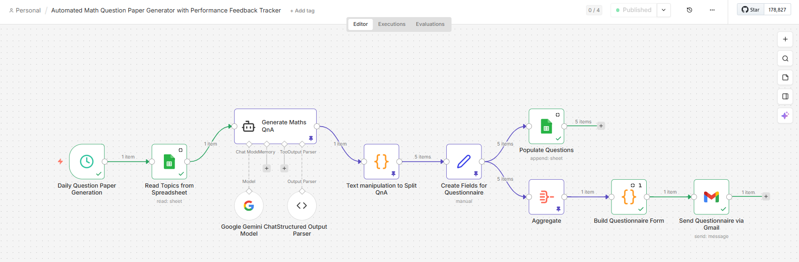
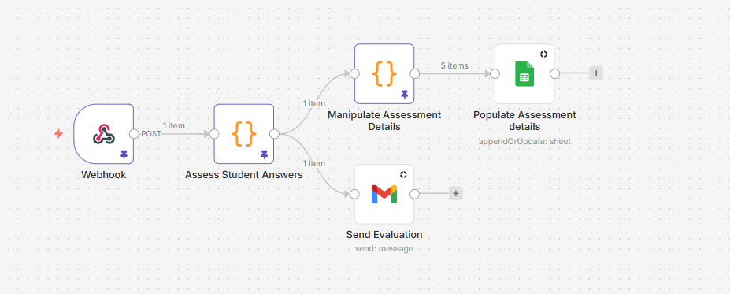
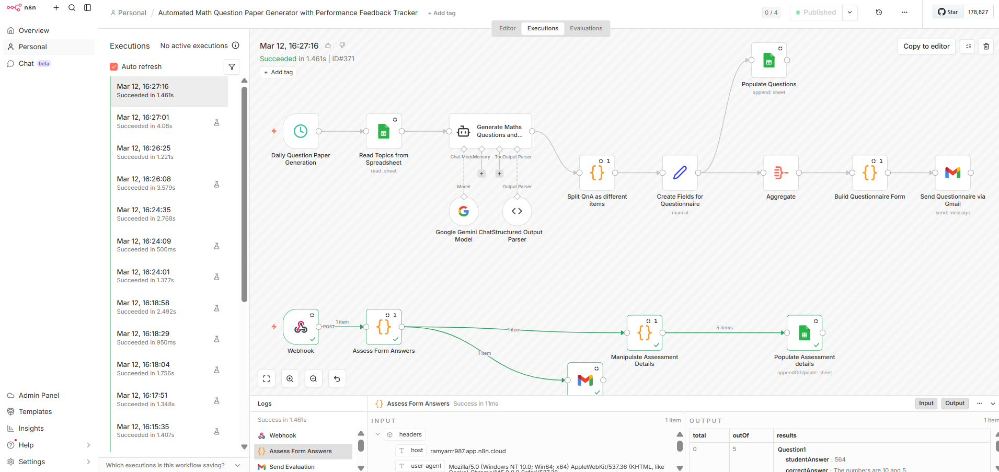
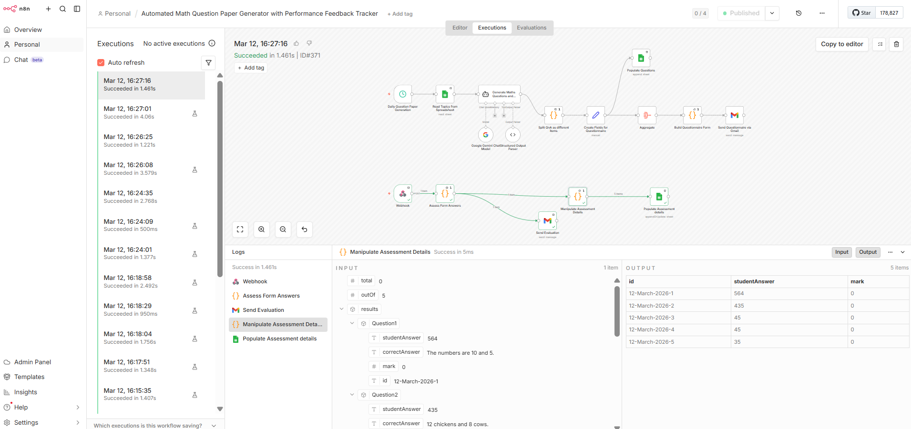
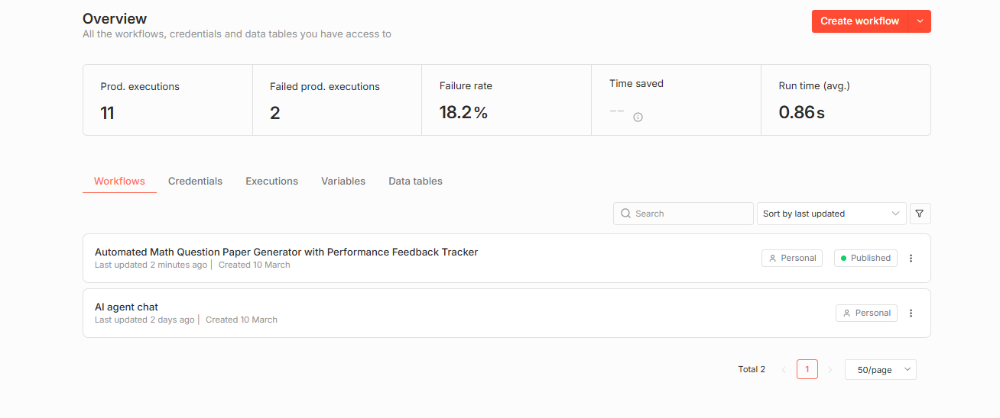
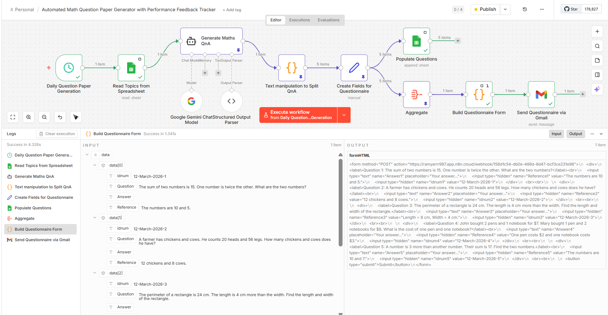
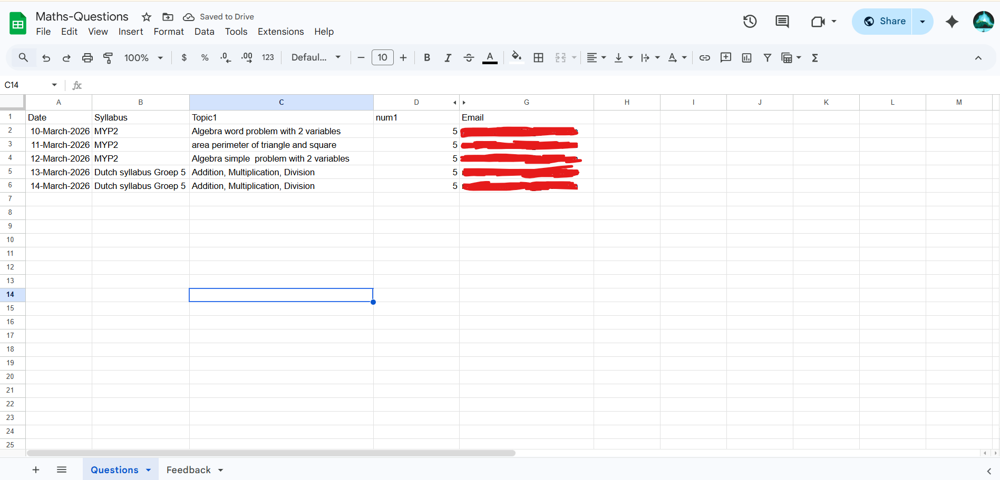
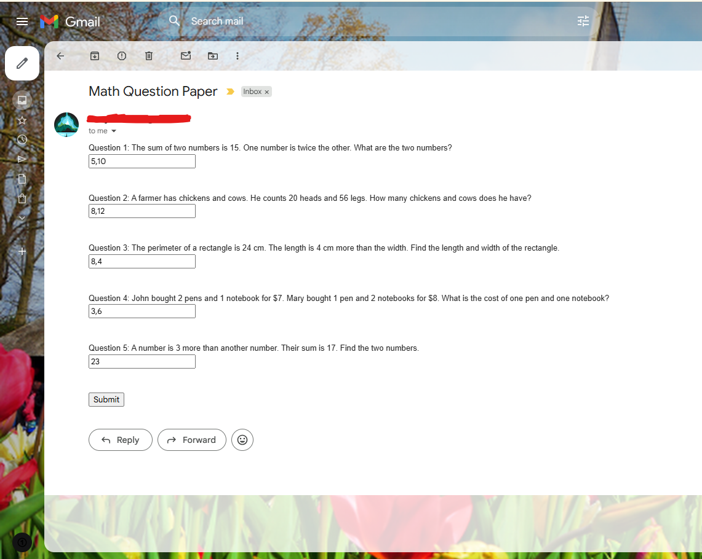
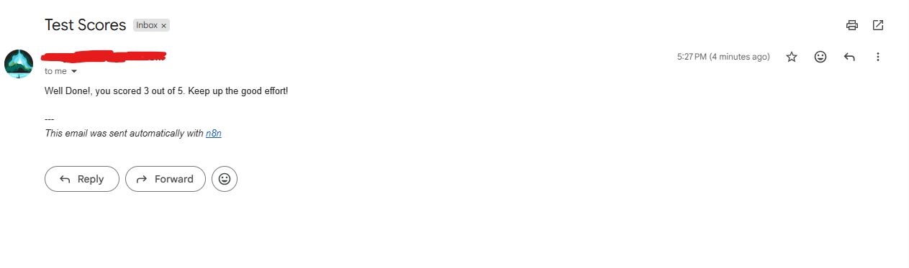
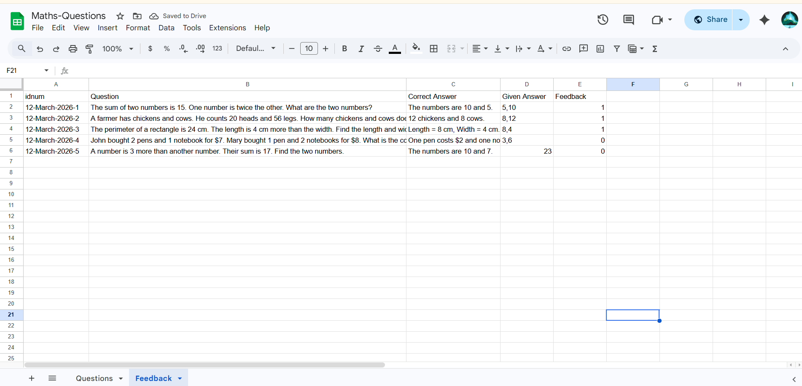

# 🤖 Automated Math Quiz System with AI & Performance Tracking

As a Support Engineer, I believe the best way to handle repetitive tasks is to automate them out of existence. This project is a production-ready **n8n workflow** that generates daily math curriculum, delivers interactive quizzes via email, and automatically grades results.

## 🚀 Key Features
* **AI-Powered Content:** Integrates **Google Gemini** to dynamically generate math questions.
* **Custom Form Engine:** Uses a JavaScript Code Node to programmatically build an HTML form.
* **Robust Assessment Logic:** Features a custom grading algorithm that uses **Regex** to extract and compare numerical values.
* **Feedback Loop:** Automatically records performance data back to **Google Sheets**.

## 🛠️ What I Built
This project is an end-to-end automation that manages the entire lifecycle of a math quiz without manual intervention.

## 1. Content Generation & Scheduling
* **Automatic Triggers:** I set up a schedule to fetch specific topics from a Google Sheet every morning.

* **AI Integration:** I integrated Google Gemini using LangChain to dynamically generate unique math questions and answers based on the daily topic.

## 2. Interactive Delivery
* **Dynamic Form Building**: I wrote custom JavaScript to transform raw AI data into a functional HTML form.

* **Email Automation:** The system automatically emails this interactive quiz directly to the student via the Gmail API.

## 3. Intelligent Grading & Tracking
* **Fuzzy Logic Assessment:** I developed a grading script that uses Regular Expressions (Regex) to extract numbers from student answers, allowing the system to mark answers as "Correct" even if the formatting varies.

* **Automated Record Keeping:** The workflow writes the student's score, the specific question, and the feedback back to a Google Sheet database for performance tracking.

* **Closing the Loop:** A final evaluation email is sent to the student immediately after submission with their total score.

## 🛠️ Technical Skills Demonstrated
* **Workflow Automation:** Advanced use of n8n for orchestrating multi-step business logic.

* **Data Normalization:** Handling API data structure discrepancies between Test and Production environments using custom JavaScript logic.

* **Programming:** * JavaScript: * Used for custom data transformation, HTML form generation, and input validation.

* **Regex (Regular Expressions):** Implemented for data extraction and "fuzzy" grading logic.

* **AI & LLM Integration:** Implementing LangChain with Google Gemini for dynamic content generation and structured JSON output.

* **API & Database Management:** Integration of Gmail API for automated communication.

* Using Google Sheets as a relational database for CRUD operations (Create, Read, Update, Delete).

## 👨‍💻 Support Engineering Skills
* **API Integration:** Webhooks, Google OAuth2, and LLM connectivity.
* **Troubleshooting:** Solving environment-specific data structure mismatches.
* **Automation:** Reducing manual overhead for educational workflows.

## Screenshots ##

* **WorkFlows**

* **Executions**

* **Interactions**

